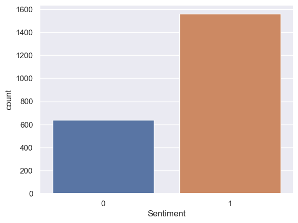
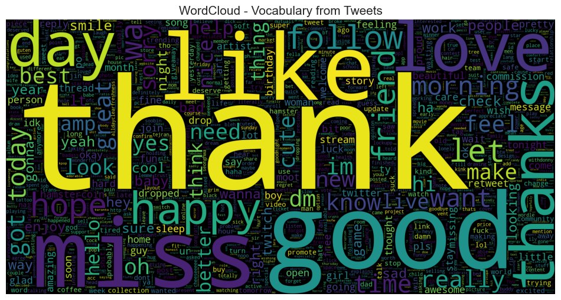
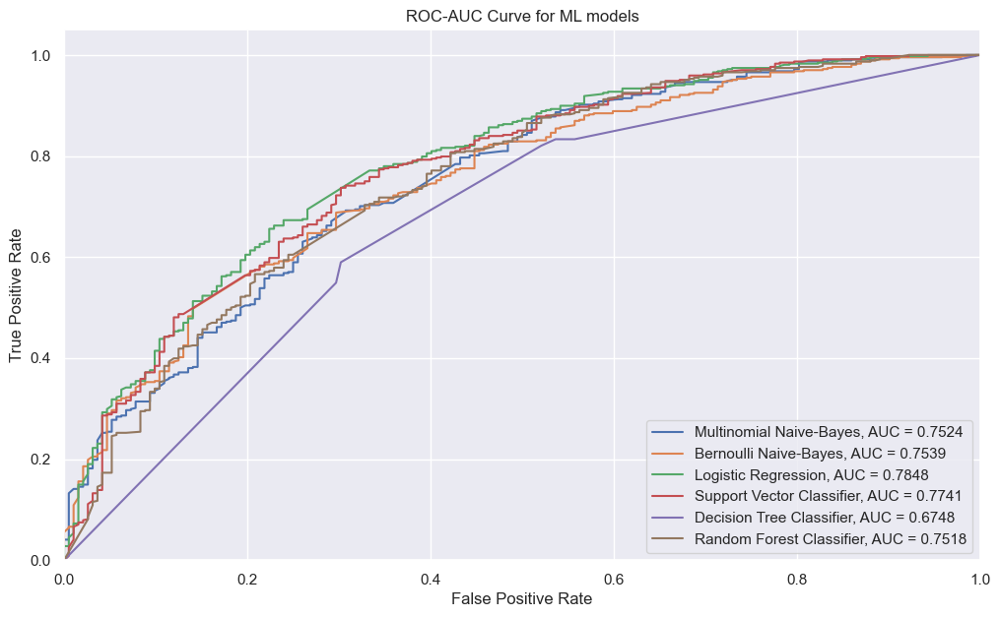
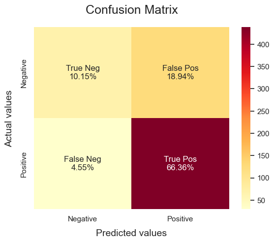
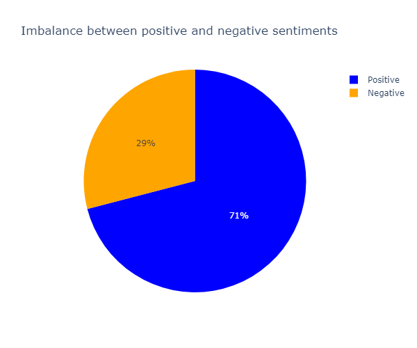
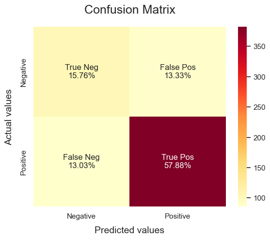

# Sentiment-Analysis-project

## Project aims/goals

This marks my first project on sentiment analysis (NLP) using Twitter (now X) datasets containing emoticons to denote positive :) or negative :( sentiment. The datasets was downloaded using the [Twitter API](https://developer.twitter.com/en/docs/twitter-api). The aims of this project are as follows:

1. Extract the tweets from the list of JSON format entries. 
2. Create another column containing the tweet sentiment (1 for positive sentiment and 0 for negative) using the respective emoticon.
3. Build a predictive model to predictive the sentiment of any tweet.

## Data gathering and cleaning

The 3905 tweets in the dataset was already downloaded in text format but still in raw form. Each item in the list is a JSON format containing no more than three nested entries. After parsing through the first entry in the list, the necessary tweet was extracted. A for-loop was subsequently used to automate the extraction process for the entire entries. A dataframe was created using the new list containing only necessary tweets (as `[Text]` column) and the accompanying emoticon was used to create the `[Sentiment]` column.

After removing null values and duplicates, the dataset to be used for analysis and modeling reduced to 2197. The `[Sentiment]` column was imbalanced as illustrated in the image



To mitigate this imbalance, the `[stratify=y]` was introduced in the `[train_test_split]` function from the Scikit-Learn module. Standard NLP preprocessing techniques were then used to clean and preprocess through a modular function. Special characters, numbers, retweet tags, were all removed, and lemmatization was applied. The WordCloud library was used to generate most frequent words in the corpus, which is also displayed in the image



The count vectorizer was used to change the corpus into vector representations for input into the model.

## Model selection and evaluation

After the preprocessing steps were completed, the prepared datasets was used to train several classifiers such as Multinomial Naive-Bayes, Bernoulli Naive-Bayes, Logistic Regression, Support Vector Classifier, Decision Tree Classifier, and Random Forest Classifier. Due to the presence of imbalance in the target, the accuracy metric was not used to evaluate model performance. Precision, Recall and F1-score were employed along with the ROC-AUC curve. Based on a these selected performance metrics, the Random Forest algorithm seems to outperform the others but Decision Tree has an advantage of being unbiased for both positive and negative sentiment (there seems to be a balance between the values for precision and recall). The ROC-AUC curve was used as the final decider:



The preferred model was the Random Forest Classifier. The hyperparameters of the preferred model was then optimized using the GridSearchCV function from the Scikit-Learn module.

## Results
- After extensive hyperparameter optimization, the Recall score for Logistic Regression was improved by $5\%$.
- The optimized model was tested on two sample tweets to predict if they contained positive or negative sentiment. The model was later saved for deployment as a web app using Flask library.

### Key takeaways
- I initally began to optimize the parameters for the Random Forest Classifier, as I chose it as the preferred model. But after some unsurmountable challenges, I instead went with the Logistic Regression. It took a bit of time (trying out different combinations of parameters) before I could get the presented results.
- I couldn't improve the accuracy but could only slightly improve the Recall by a mere $5\%$. The comparison of the Logistic Regression classifier is done by presenting the results before optimization



and after optimization


This seems to be substantial progress when compared to the initial distribution of the sentiments



The optimized model can only account for approximately $17\%$ of the negative sentiment compared to an initial approximately $15\%$. Comparing these results with the Random Forest Classifier


and the Decision Tree Classifier,



the Decision Tree Classifier actually accounts for almost all the negative sentiments but it had the lowest ROC-AUC curve (see third image).

## Challenges 
 - Spent a reasonable amount of time going back and forth between the hyperparameter optimization options for both the Logistic Regression and Random Forest Classifier models.
 - The dataset is quite small, than I expected.

## Future Goals
- Find out ways to improve the accuracy of the models. Optimize the Decision Tree Classifier and see if the ROC-AUC curve will improve as it is the most unbiased model.
- Develop a model within an ETL pipeline that will download live data from a Twitter API and make real-time predictions.

### Repo structure

```
├── README.md           <-- Markdown file explaining the project's 
|                              approach, methodology, and findings
│
├── tweets.txt           <-- Original dataset used in preprocessing and
|                             training the classification model.
│
├── NLP_sentiment_analysis.ipynb   <-- Files with user defined functions 
|                                        and classes
│
├── api_app.py           <-- Flask app used to deploy trained classification 
|                              model
│
├── outputs              <-- Contains the saved model file (final_model.sav)
|                             and the saved vectorizer (vectorizer.sav)
│
├── figures            <-- Contains figures used in the README.md file
│
├── templates          <-- Contains HTML file for rendering the frontend of 
|                              Flask app
```

### Tech stack

* `Pandas`, `Numpy` libraries for data analysis
* `Wordcloud` library for visualizing most frequent words in corpus
* `NLTK` library for NLP preprocessing
* `Flask` library for deploying the model
* `Scikit-Learn` library for model evaluation and performance review
* `Matplotlib`, `Seaborn`, `Plotly` libraries for visualizations
* `Pickle` library for saving and loading pretrained model and vectorizer

This is a little demonstration of the model's prediction through the Flask app

<video width="640" height="300" controls>
  <source src="figures/flask_demo.mov" type="video/mp4">
</video>

> This is my first NLP model which is a simple Twitter sentiment predictor. In the not too distant future, I aim to work on more complicated NLP projects. Please reach out to me if you have further ideas or suggestions to improve this project. I am also very much open to collaborating. **I am available through e-mail** drsamuelsurulere@gmail.com